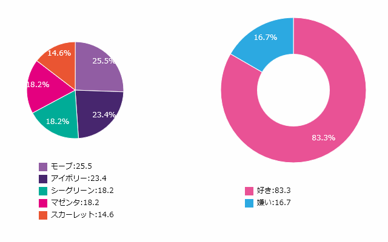

# グラフ描画ライブラリ

## 概要
Canvas上にグラフを描画するライブラリを作りました。
描画できるグラフは今のところ円グラフとレーダーチャートのみです。

## 使い方
0. グラフのデータを下記のような2次元配列で用意してください。
	[色, 項目, 値]

	const sectInfo = [
		["red", "php", 80],
		["blue", "pdo", 40],
		["green", "java", 30],
		["#c70067", "html", 20],
		["orange", "css", 60],
		["purple", "others", 70],
		["#a22041", "C", 120],
	];
1. グラフを描画したいhtmlファイルの任意の場所にhtml5のcanvas要素を作ります。
	<canvas id="can"></canvas>
2. Circle.jsファイルを読み込みます。
	
3. 読み込んだあとに新しくスクリプトタグを用意するか、新しくJSファイルを作成し読み込みます。
4. インスタンスを作成します。
	new DrawCircle(キャンバスID, グラフ配列, 円グラフの半径, 中心X座標, 中心Y座標, グラフタイプ, レーダーチャートの場合その最大値);
5. update関数を作成し、その中でインスタンス化したクラスのupdateメソッドを呼び出してください。
6. draw関数を作成し、その中でインスタンス化したくらすのdrawメソッドを呼び出してください。
7. メインループ関数を作成しupdate関数とdraw関数を呼び出してください。
8. window.onloadでメインループ関数を呼び出してください。

	サンプルコード
	circle = new DrawCircle('can', sectInfomation, 200, 400, 250, 2, 100);

	function update()

	{

		circle.update();

	}

	function draw()

	{

		DrawCircle.clear('can');

		circle.draw();

	}

	function mainLoop()

	{

		requestAnimationFrame(mainLoop);

		update();

		draw();

	}

	window.onload = function() {

		mainLoop();

	}

